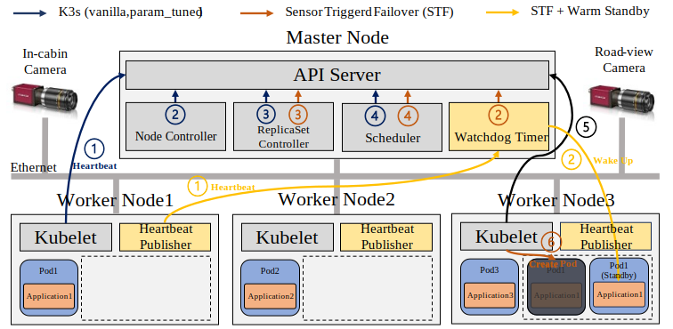

# Introduction
This repository serves as a container orchestrator for future SDV architectures. It provides an ultra-fast failover framework built on the lightweight container orchestrator K3s (compatible with NVIDIA Jetson series) and a Sensor Watchdog Timer mechanism to preserve vehicle applications with near-zero downtime and guarantee occupant safety.

To manage multiple containerized applications, we chose K3s, a lightweight Kubernetes distribution, as our orchestration tool. Each containerized application is assigned an Automotive Safety Integrity Level (ASIL) and deployed on a distributed cluster forming a zonal architecture. Although K3s’s built-in failover can migrate containers when a node fails, its response time alone is insufficient for vehicle systems. Therefore, we propose a failover mechanism that combines a sensor-triggered watchdog with system redundancy. In experiments across various failure scenarios, our system reduced K3s’s default failover delay of over 300 seconds to under 1 second meeting the fault tolerant timing requirements for vehicle safety and demonstrating that container technology can be applied to safety critical automotive systems. We expect this architecture to make a significant contribution to future automotive E/E architecture design.


<br>


### Clone K3s Source and Checkout Desired Version
To perform a custom build of K3s, you must first download the source code from the official GitHub repository and switch to the version you want to modify or build.

```bash
git clone https://github.com/k3s-io/k3s.git

cd k3s

git checkout tags/v1.27.11+k3s1
```

### 🔍 Check Required Go Version

To build K3s, you need a compatible Go version. Check the `go.mod` file in the source root directory to see which version is specified:

```bash
# Change to the K3s source directory
cd k3s

# Check the required Go version in go.mod
grep "^go " go.mod
```

### Install Go
```bash
wget https://go.dev/dl/go1.21.7.linux-arm64.tar.gz

sudo tar -C /usr/local -xzf go1.21.7.linux-arm64.tar.gz

export PATH=$PATH:/usr/local/go/bin
```
### Modify version.sh
⚠️ K3s must be built with a Go version compatible with the selected K3s release.  
Using the latest Go version may cause build failures due to incompatibility.  
To ensure a successful build, install and use the Go version required by the specific K3s release.

```bash
- VERSION_GOLANG="go"$(curl -sL "${DEPENDENCIES_URL}" | yq e '.dependencies[] | select(.name == "golang: upstream version").version' -)
+ VERSION_GOLANG="go1.21.7"
```

### Set Environment Variable to Skip Binary Download
During the build or manual installation process, K3s may attempt to download its binary from the internet.
To prevent this (e.g., when using a locally built binary), you can set the following environment variable in your shell configuration

```bash
export INSTALL_K3S_SKIP_DOWNLOAD=true

//After editing .bashrc, apply the changes with:
source ~/.bashrc
```

